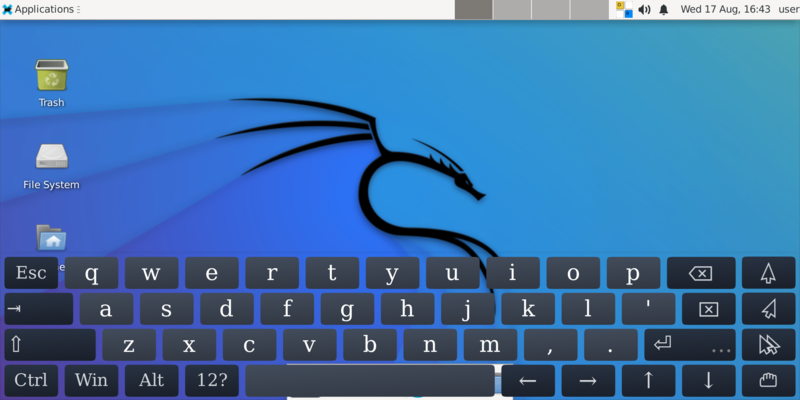
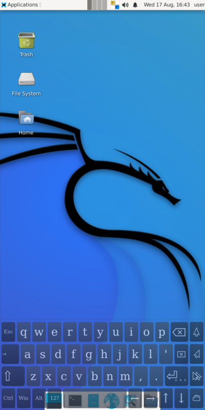

:toc:
:toc-placement!:
:toclevels: 6

= harbour-containers

_A Linux containers (LXC) manager for SailfishOS_

image::https://raw.githubusercontent.com/Kabouik/harbour-containers/master/icons/172x172/harbour-containers.png[]  

toc::[]

=== Documentation

==== What is it?
`harbour-containers` is a SailfishOS application to create, download, manage and run LXC containers from a convenient GUI. It relies on `Xwayland` to run the associated desktop environment inside a new Sailifsh window:

==== Installation
NOTE: Before proceeding, make sure  https://github.com/sailfish-containers/lxc-templates-desktop/wiki/Requirements[LXC kernel requirements] are satisfied.

1. Install dependencies:
+
[source,bash]
----
devel-su
pkcon install zypper # If you don't have it installed already
zypper install nemo-qml-plugin-dbus-qt5 sailfish-polkit-agent python3-base python3-gobject dbus-python3 xz
----
+
[start=2]
2. Manually download https://repo.sailfishos.org/obs/home:/kabouik/[here] the latest version of `lxc-templates-desktop` ("noarch" folder), `qxcompositor` and `harbour-containers` in the folder that corresponds to your device architecture.

3. Install them either from your Sailfish file manager or using:
+
[source,bash]
----
cd /path/to/directory/where/you/downloaded/the/three/rpms
devel-su
zypper install lxc-templates-dekstop-<VERSION>.rpm
zypper install qxcompositor-<VERSION>.rpm
zypper install harbour-containers-<VERSION>.rpm
----

==== How to use?
The GUI of `harbour-containers` should be straightforward, but see https://github.com/sailfish-containers/lxc-templates-desktop/wiki[lxc-templates-desktop's wiki] for more details and CLI usage.

If unfortunately you checked "Setup desktop" when creating a new container but just saw the new container icon appear and then stop witnout a terminal prompting your for a user password, then the desktop was not configured. Go into that container in the GUI, press "init container config", and then "setup xsession".

=== Discussion
See the https://talk.maemo.org/showthread.php?t=101080[TMO thread].

=== Demos
Kali with XFCE4 alongside SailfishOS:

image::https://user-images.githubusercontent.com/7107523/99102454-feeae200-25d5-11eb-935f-b846233e8808.gif[]  

You can run any Linux desktop application that has been compiled for your architecture. See for instance `rofi` and `Darktable` below:

image::https://user-images.githubusercontent.com/7107523/99102434-fa262e00-25d5-11eb-853f-f203327f9a55.gif[]  

While LXC containers of desktop Linux distributions are most convenient with a hardware keyboard phone like the F(x)tec Pro1 and Pro1x, `Onboard` is also preinstalled for compatibility with other smartphones:

image::https://user-images.githubusercontent.com/7107523/99102422-f5fa1080-25d5-11eb-9d74-b7a09c1a9a22.gif[]  

A video showcasing what LXC containers can do on SailfishOS is available https://youtu.be/-dgD5jci8Dk[here]. Moar videos https://movio.sauru.sh/mobilelinux[here].

=== License
This project is proudly licensed under GNU GPLv3.

=== Credits
Many thanks to all testers and contributors: 
 
* https://github.com/r3vn[r3vn (main dev)]  
* https://github.com/g7[g7]  
* https://github.com/eLtMosen[eLtMosen]  
* https://github.com/Kabouik[Kabouik]  
* https://www.flaticon.com/free-icons/container-ship[Container ship icon modified from Freepik - Flaticon]
