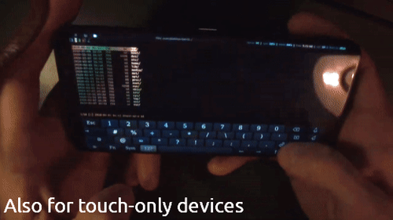
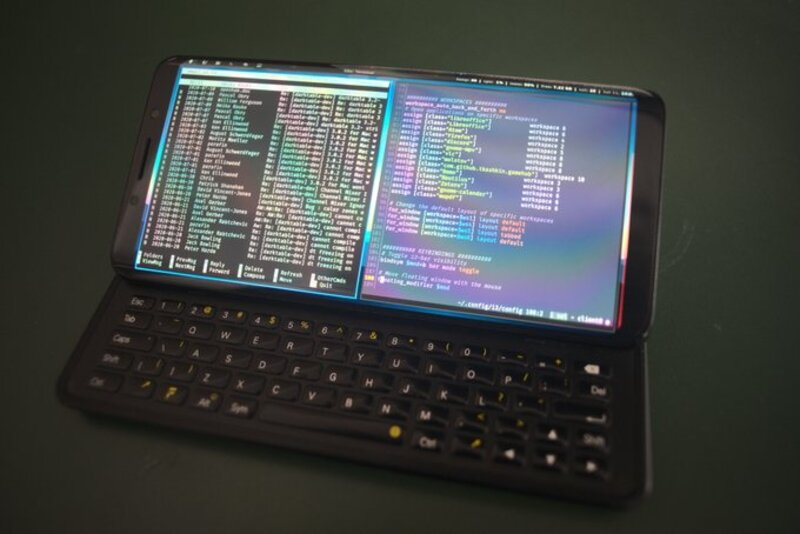
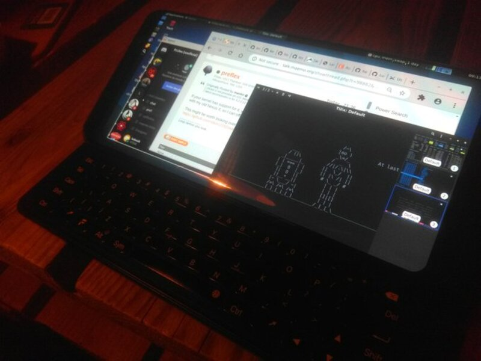
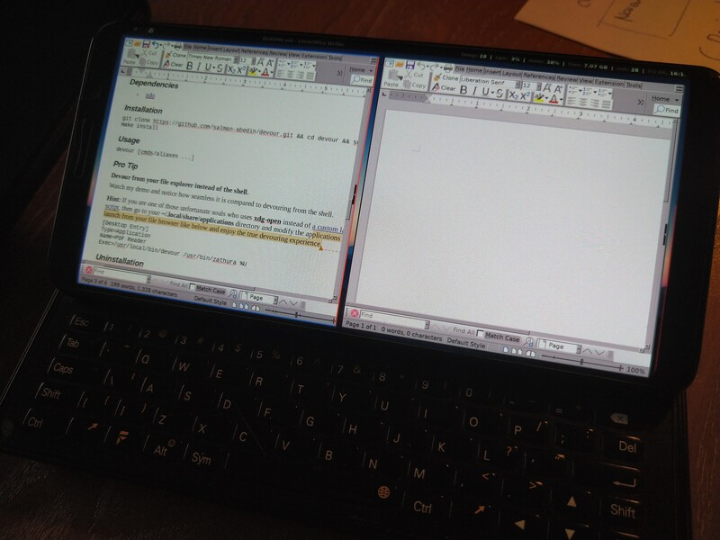
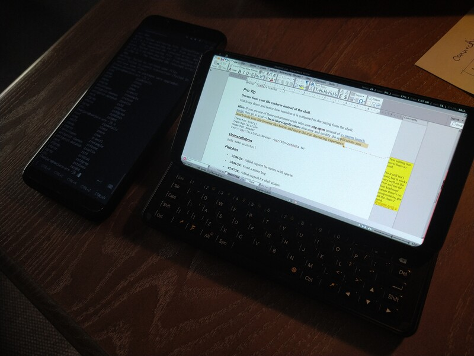

:toc:
:toc-placement!:
:toclevels: 4

= Containers

_A LXC manager and runner for SailfishOS_

image::https://raw.githubusercontent.com/sailfish-containers/harbour-containers/devel-k/icons/172x172/harbour-containers.png[]  

:toc: macro

==== ———
toc::[]

== Documentation

=== What is it?
_Containers_ (`harbour-containers`) is a SailfishOS application to create, download, manage and run Linux containers (LXC) from a convenient GUI. It currently supports Arch- and Debian-based distributions, and can configure them with Xfce4 or i3 as default DE/WM. It relies on `Xwayland` to run the associated desktop environment inside a new SailifshOS window:

[cols="a,a", frame=none, grid=none]
|===
2+|image::pics/debian-i3_800.jpg[Debian i3]
2+|image::pics/arch-i3_800.jpg[Arch i3]
|image::pics/kali-xfce4_800.jpg[Kali xfce4]
|image::pics/arch-xfce4_800.jpg[Arch xfce4]
2+|image::pics/kali-i3_800.jpg[kali i3]
|===

=== Installation
NOTE: Before proceeding, make sure  https://github.com/sailfish-containers/lxc-templates-desktop/wiki/Requirements[LXC kernel requirements] are satisfied.

===== From Chum community repository (stable)
1. Uninstall manually installed version, if any
+
If you never used `harbour-containers` before, jump to step 2. Else, if you had a version of `harbour-containers` installed from a source other than Chum (_e.g._, an older version before Chum or a devel build), then you need to uninstall it first because Chum is designed to *not* overwrite packages if they don't match vendor (presumably installed manually):
+
[source,bash]
----
devel-su
ps aux | grep -ie daemon.py | awk '{print $2}' | xargs kill -9 2> /dev/null # Kill the daemon
zypper remove harbour-containers qxcompositor lxc-templates-dekstop # Uninstall packages
zypper remove qxdisplay # Just in case you have it too as it is obsolete now
----
+
[start=2]
2. Install Chum from https://chumrpm.netlify.app/[here], then search for "Containers" in its app list. You're done.
+
[cols="a,a", frame=none, grid=none]
|===
|image::pics/Screenshot_20220818_001_480.png[]
|image::pics/sfos-covers_480.jpg[] 
|===

===== From command line (devel builds)
1. Install dependencies:
+
[source,bash]
----
devel-su
pkcon install zypper # If you don't have it installed already
zypper install nemo-qml-plugin-dbus-qt5 sailfish-polkit-agent python3-base python3-gobject dbus-python3 xz
----
+
[start=2]
2. https://repo.sailfishos.org/obs/home:/kabouik/[From the folder matching your SFOS version and device architecture], manually download the following packages:
 * `lxc-templates-desktop` ("noarch" subfolder),
 * `qxcompositor` (your architecture subfolder),
 * `harbour-containers` (your architecture subfolder too).

3. Install them either from your SailfishOS file manager or using:
+
[source,bash]
----
cd /path/to/directory/where/you/downloaded/the/three/rpms
devel-su
ps aux | grep -ie daemon.py | awk '{print $2}' | xargs kill -9 2> /dev/null # Kill the daemon in case an older version was running
zypper install lxc-templates-dekstop-<VERSION>.rpm
zypper install qxcompositor-<VERSION>.rpm
zypper install harbour-containers-<VERSION>.rpm
----

Those three packages will have to be uninstalled manually before stable builds can be installed from Chum again, see above section.

=== How to use?

==== SailfishOS side
NOTE: For now, the application requires that your SailfishOS user name is `defaultuser`. For `nemo` users from older SailfishOS versions, or custom user names, a symbolic link won't be enough to start X from the GUI (but you can still create and manage containers from it, and launch X from CLI). See https://github.com/sailfish-containers/harbour-containers#known-issueslimitations[known issues].

The GUI of `harbour-containers` should be relatively straightforward, see a brief description of GUI elements below:

.Click to expand the description of each GUI element
[%collapsible]
====
`▶ Main page`

    ⨁  icon:: Create a new container (you will need to set a device lock code in SailfishOS settings first), **only Debian-based distributions are supported at the moment**

`*▶ Container creation page*`

    Setup desktop:: Execute a script after container creation to install a basic desktop environment (this can be done later too)

`*▶ Existing container page*`

    attach:: Open a terminal window as `root` within the contained distribution
    X session::  Open a new SailfishOS window showing the X desktop of the distribution, if the desktop was set up first
    mountpoints::  List of the default mount points for the container (you can edit it in `/var/lib/lxc/<container-name>/config`)
    run onboard::  Show a floating icon in the X session that allows opening a virtual keyboard (long press on Return to close it)
    kill Xwayland::  May be necessary to close and reopen (with the "X session" button above" the window showing the desktop environment
    setup xsession::  Run a script to set up your user and password, as well as default settings for your desktop environment (same as "Setup desktop" above in the container creation page)
    init container config::  Run this first after container creation if you didn't check "Setup desktop" in the first place; can only be ran on a stopped container

`*▶ Pulley menus*`

    Settings::  Change container icon, destroy container (this cannot be undone), or set fixed orientation (obsolete)
    Snapshots::  View LXC snapshots created using `lxc-snapshot` (see https://github.com/sailfish-containers/lxc-templates-desktop/wiki[lxc-templates-desktop's wiki])
    Freeze/Unfreeze (all)::  Freeze/Unfreeze container to save resources
    Start/Stop (all)::  Start/stop container
====

NOTE: If unfortunately a terminal window did not appear after you created a new container, despite checking "Setup desktop", then you will have to go into the page of that new container, hit "init container config" at the bottom, start the container from the pulley menu, and then hit "setup xsession". The installation and configuration should then proceed.

See https://github.com/sailfish-containers/lxc-templates-desktop/wiki[lxc-templates-desktop's wiki] for more details and CLI usage (with extra features). 

==== Container side
If you picked i3 as your window manager, `Alt` is your `$mod`, so `Alt`+`Return` to open a terminal, and `Alt`+`d` for `dmenu`. Your i3 configuration can be changed in `~/.config/i3/config`.

== Known issues/limitations

* If your SailfishOS username is not `defaultuser`, then the GUI cannot start an X session; this is being worked on and in the mean time, you can try https://github.com/sailfish-containers/lxc-templates-desktop/wiki/Desktop#start-desktop[opening the X session from CLI]
* No sound in aarch64 devices, and it may silence SFOS sounds as well (else, please tell us)
* No hardware acceleration
* Only prebuilt binaries of Xwayland can be used at the moment inside containers (this is automated when setting up xsession from the GUI), because latest sources don't support the XDG_WM_Base protocol that we need

== Discussion
See the https://talk.maemo.org/showthread.php?t=101080[TMO thread].

== Demos

* Debian with i3 WM on a Pro1x running SailfishOS, with dynamic rotation (and rotation lock with keyboard opening):
+
image::pics/dynamicorientation.gif[]

* The containers run in their own window alongside SailfishOS:
+
image::pics/99102454-feeae200-25d5-11eb-935f-b846233e8808.gif[]  

* You can run any Linux desktop application that has been compiled for your architecture. See for instance `rofi` and `Darktable` below:
+
image::pics/99102434-fa262e00-25d5-11eb-853f-f203327f9a55.gif[]  

* While LXC containers of desktop Linux distributions are most convenient with a hardware keyboard phone like the F(x)tec Pro1 and Pro1x, `Onboard` is also preinstalled for compatibility with other smartphones:
+
  

*  More pics:
+

* A video showcasing what LXC containers can do on SailfishOS is available https://youtu.be/-dgD5jci8Dk[here]. Moar videos https://movio.sauru.sh/mobilelinux[here].

== License
This project is proudly licensed under GNU GPLv3.

== Credits
Many thanks to all contributors and testers: 
 
* https://github.com/r3vn[r3vn (main dev)] - https://github.com/g7[g7] - https://github.com/Kabouik[kabouik] - https://github.com/eLtMosen[eLtMosen] - https://github.com/elros34[elros34] - https://github.com/edp17[edp17] - https://github.com/vaskas[vaskas] - https://github.com/sashinfantry[dashinfantry] - https://github.com/hengyedev[HengYeDev]  
* https://www.flaticon.com/free-icons/ship[Container ship icon modified from pongsakornRed's, Flaticon]
