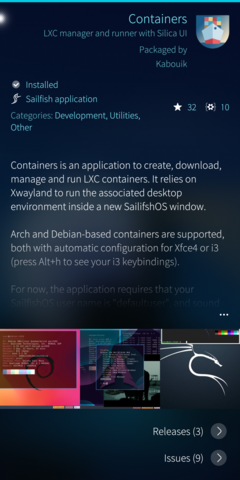

:toc:
:toc-placement!:
:toclevels: 4

= Containers

_A LXC manager and runner for SailfishOS_

image::https://raw.githubusercontent.com/sailfish-containers/harbour-containers/master/icons/172x172/harbour-containers.png[]  

:toc: macro

==== ———
toc::[]

== Documentation

=== What is it?
_Containers_ (`harbour-containers`) is a SailfishOS application to create, download, manage and run Linux containers (LXC) from a convenient GUI. It relies on `Xwayland` to run the associated desktop environment inside a new SailifshOS window:

image::pics/Screenshot_20220817_005_800.png[]
image::pics/Screenshot_20220817_004_800.png[]
image::pics/E5vInvOWQAMcxLg_800.jpeg[]

=== Installation
NOTE: Before proceeding, make sure  https://github.com/sailfish-containers/lxc-templates-desktop/wiki/Requirements[LXC kernel requirements] are satisfied.

===== From Chum community repository
Install Chum from https://chumrpm.netlify.app/[here], then search for "Containers" in its app list.

===== From command line
1. Install dependencies:
+
[source,bash]
----
devel-su
pkcon install zypper # If you don't have it installed already
zypper install nemo-qml-plugin-dbus-qt5 sailfish-polkit-agent python3-base python3-gobject dbus-python3 xz
----
+
[start=2]
2. Manually download https://repo.sailfishos.org/obs/home:/kabouik/[here] the latest version of `lxc-templates-desktop` ("noarch" folder), and `qxcompositor` and `harbour-containers` (in the folder that corresponds to your device architecture).

3. Install them either from your Sailfish file manager or using:
+
[source,bash]
----
cd /path/to/directory/where/you/downloaded/the/three/rpms
devel-su
zypper install lxc-templates-dekstop-<VERSION>.rpm
zypper install qxcompositor-<VERSION>.rpm
zypper install harbour-containers-<VERSION>.rpm
----

=== How to use?
The GUI of `harbour-containers` should be straightforward, but see https://github.com/sailfish-containers/lxc-templates-desktop/wiki[lxc-templates-desktop's wiki] for more details and CLI usage.

If unfortunately you checked "Setup desktop" when creating a new container but just saw the new container icon appear and then stop witnout a terminal prompting your for a user password, then the desktop was not configured. Go into that container in the GUI, press "init container config", and then "setup xsession".

== Discussion
See the https://talk.maemo.org/showthread.php?t=101080[TMO thread].

== Demos

* Debian with i3 WM on a Pro1x running SailfishOS, with dynamic rotation (and rotation lock with keyboard opening):
+
image::pics/dynamicorientation.gif[]

* Kali with XFCE4 alongside SailfishOS:
+
image::pics/99102454-feeae200-25d5-11eb-935f-b846233e8808.gif[]  

* You can run any Linux desktop application that has been compiled for your architecture. See for instance `rofi` and `Darktable` below:
+
image::pics/99102434-fa262e00-25d5-11eb-853f-f203327f9a55.gif[]  

* While LXC containers of desktop Linux distributions are most convenient with a hardware keyboard phone like the F(x)tec Pro1 and Pro1x, `Onboard` is also preinstalled for compatibility with other smartphones:
+
  

*  More pics:
+

image::pics/Eo_d7waW4AI17FB_800.jpeg[]

* A video showcasing what LXC containers can do on SailfishOS is available https://youtu.be/-dgD5jci8Dk[here]. Moar videos https://movio.sauru.sh/mobilelinux[here].

== Known issues/limitations

* No sound in aarch64 devices (or please tell us)
* No hardware acceleration
* Only prebuilt binaries of Xwayland can be used at the moment inside containers (this is automated when setting up xsession from the GUI), because latest sources don't support the XDG_WM_Base protocol that we need

== License
This project is proudly licensed under GNU GPLv3.

== Credits
Many thanks to all contributors and testers: 
 
* https://github.com/r3vn[r3vn (main dev)] - https://github.com/g7[g7] - https://github.com/Kabouik[kabouik] - https://github.com/eLtMosen[eLtMosen] - https://github.com/elros34[elros34] - https://github.com/edp17[edp17] - https://github.com/vaskas[vaskas] - https://github.com/sashinfantry[dashinfantry] - https://github.com/hengyedev[HengYeDev]  
* https://www.flaticon.com/free-icons/container-ship[Container ship icon modified from Freepik - Flaticon]
